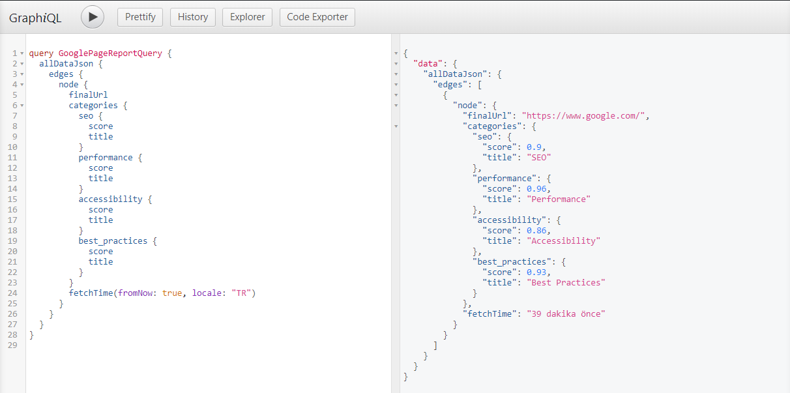

Firstly you need to install Lighthouse.

 <deckgo-highlight-code>
    <code slot="code">
npm install -g lighthouse
    </code>
</deckgo-highlight-code>

You should output all the results of the website you want to analyze in JSON format.

 <deckgo-highlight-code>
    <code slot="code">
 lighthouse --output json --output-path
    </code>
</deckgo-highlight-code>

You can use <a href='https://www.gatsbyjs.org/'>Gatsby JS</a> to pull graphql queries.

Now, let's create our query and filter only the data we want.

**Conclusion**

You can then create a React-based report system that integrates the query we created with `useStaticQuery` in Gatsby.

<a href='https://developers.google.com/web/tools/lighthouse'>More</a>